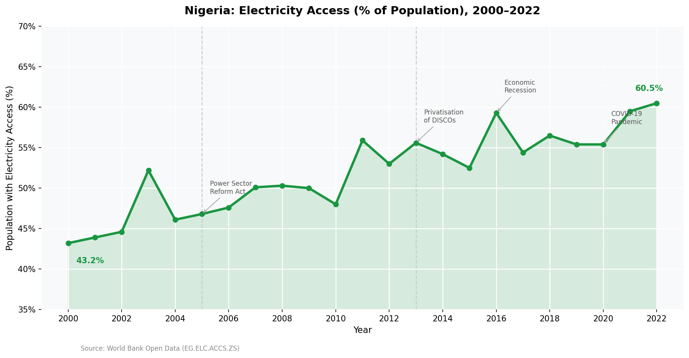
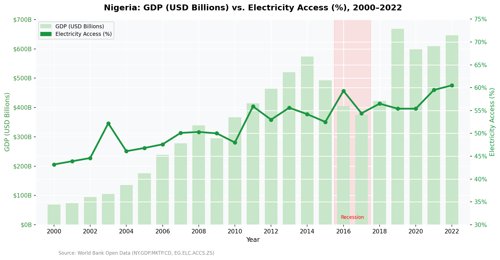
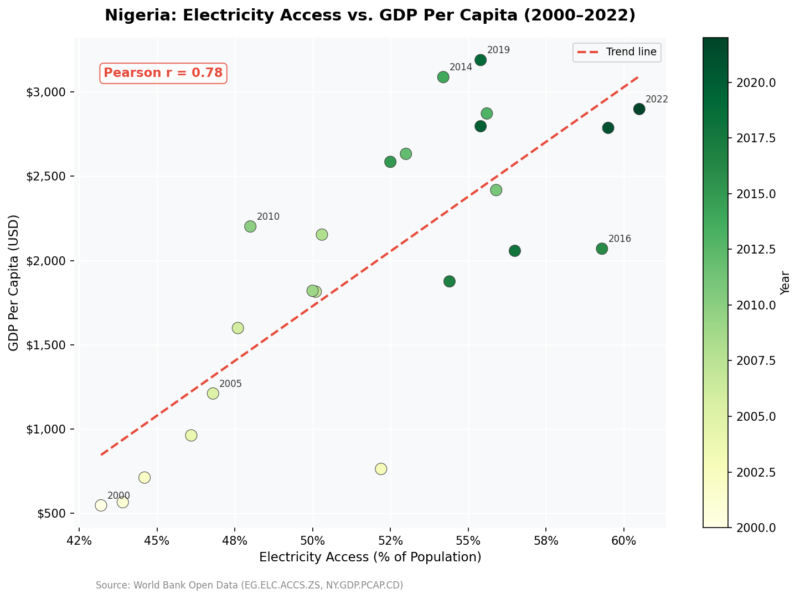
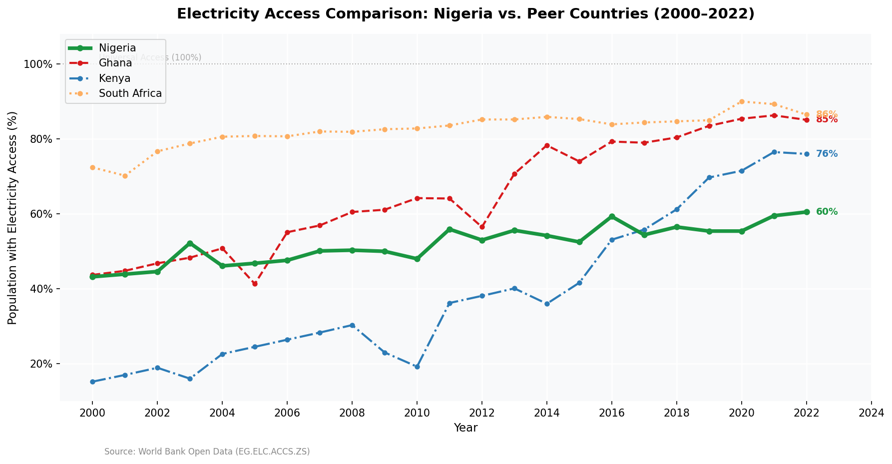
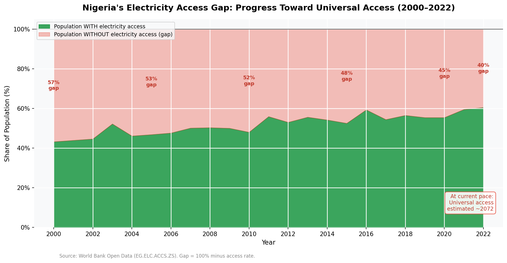

# Powering Growth: Nigeria Energy Access & GDP Analysis (2000–2022)


---

## Project Overview

This project investigates the relationship between electricity access and economic
output in Nigeria from 2000 to 2022, benchmarked against three peer African economies:
Ghana, Kenya, and South Africa.

The analysis was conducted from a **data consulting perspective** — every finding is
framed around a decision that a policymaker, development finance institution, or
energy investor could act on.

---

## Business Question

> *Does improved electricity access drive GDP growth in Nigeria — and where should
> investment be prioritised to close the remaining gap?*

---

## Key Findings

| # | Finding | Implication |
|---|---------|-------------|
| 1 | Electricity access rose from **43.2% (2000) to 60.5% (2022)** — a gain of 17.3 percentage points | Progress is real but slow; 39.5% of Nigerians still lack access |
| 2 | Nigeria's GDP grew from **$69B to $647B** with extreme volatility (-17.9% to +58.4%) | Growth is oil-dependent, not broad-based |
| 3 | **Pearson r = 0.78** between electricity access and GDP per capita | Strong positive correlation — but relationship weakens after 2014 recession |
| 4 | **Ghana overtook Nigeria** in electrification despite a far smaller economy | Economic size alone does not guarantee infrastructure development |
| 5 | At the current pace, **universal access will not be achieved until the 2040s** | Business-as-usual is insufficient; accelerated investment is required |

---

## Consulting Recommendation

Nigeria requires a dual-track energy investment strategy:

**Track 1 — Grid Rehabilitation (Urban & Peri-Urban)**
Reduce aggregate technical and commercial losses (ATC&C) in electricity distribution,
which currently average 40–50%. Without grid efficiency, new generation capacity
cannot reach end users.

**Track 2 — Off-Grid & Mini-Grid Expansion (Rural)**
Replicate Kenya's successful decentralised solar and mini-grid model in Nigeria's
underserved North-East and North-West zones. The REA and NERC regulatory frameworks
already provide the foundation — what is needed is dedicated development finance at scale.

---

## Charts Produced

| Chart | Description |
|-------|-------------|
|  | **Nigeria's Electricity Access Journey (2000–2022)** — Annotated with key policy events |
|  | **GDP vs. Electricity Access** — Dual-axis chart showing divergence after 2014 |
|  | **Scatter Plot: Access vs. GDP Per Capita** — Trend line with Pearson r = 0.78 |
|  | **Peer Comparison** — Nigeria vs. Ghana, Kenya, South Africa |
|  | **The Access Gap** — Projected year of universal access at current pace |

---

## Project Structure

```
nigeria-energy-gdp-analysis/
│
├── data/
│   ├── raw/                        ← Original World Bank CSV files (not tracked by Git)
│   └── cleaned/                    ← Processed outputs from Notebook 01
│       ├── master_energy_gdp.csv   ← All 4 countries merged (92 rows × 11 columns)
│       └── nigeria_energy_gdp.csv  ← Nigeria-only slice
│
├── notebooks/
│   ├── 01_data_cleaning.ipynb      ← Load, clean, validate, merge, save
│   └── 02_exploratory_analysis.ipynb ← 5 analytical questions + 5 charts
│
├── visuals/                        ← 5 exported PNG charts (150 DPI)
├── requirements.txt
└── README.md
```

---

## Data Sources

| Dataset | Indicator Code | Source |
|---------|---------------|--------|
| Electricity access (% of population) | EG.ELC.ACCS.ZS | World Bank Open Data |
| GDP, current USD | NY.GDP.MKTP.CD | World Bank Open Data |
| GDP per capita, current USD | NY.GDP.PCAP.CD | World Bank Open Data |
| Energy use per capita (kg oil equivalent) | EG.USE.PCAP.KG.OE | World Bank Open Data |

All data downloaded from [data.worldbank.org](https://data.worldbank.org) — free and publicly available.

---

## Tools & Technologies

| Tool | Version | Purpose |
|------|---------|---------|
| Python | 3.14 | Core programming language |
| Pandas | 2.x | Data loading, cleaning, transformation |
| NumPy | 1.x | Numerical calculations |
| Matplotlib | 3.x | Chart production |
| Seaborn | 0.x | Statistical visualisation |
| Jupyter Notebook | 7.x | Interactive analysis environment |

---

## How to Reproduce This Analysis

**1. Clone the repository**
```bash
git clone https://github.com/YOUR_USERNAME/nigeria-energy-gdp-analysis.git
cd nigeria-energy-gdp-analysis
```

**2. Install dependencies**
```bash
pip install -r requirements.txt
```

**3. Download raw data**

Visit [data.worldbank.org](https://data.worldbank.org) and download CSV files for the
four indicator codes listed above. Place them in `data/raw/`.

**4. Run the notebooks in order**
```bash
jupyter notebook
```
- Open and run `01_data_cleaning.ipynb` first
- Then open and run `02_exploratory_analysis.ipynb`

---

## Related Projects
gulf-renewable-energy-analysis


## About the Analyst

This project was completed as part of a data analytics portfolio development programme,
applying Python-based data analysis to Nigerian macroeconomic and energy data.

The analyst brings a background in economics and quantitative research, with
technical skills in Python (Pandas, Matplotlib), SQL, and data visualisation.

---

## Contact

- **GitHub:** [github.com/YOUR_USERNAME](https://github.com/YOUR_USERNAME)
- **LinkedIn:** [linkedin.com/in/YOUR_PROFILE](https://linkedin.com/in/YOUR_PROFILE)

---

*Data sourced from World Bank Open Data. Analysis conducted for portfolio and
educational purposes. All findings represent the analyst's interpretation of
publicly available data.*
